# terraform-gke-platform

Portfolio project: a production-shaped GKE-on-GCP platform, provisioned end-to-end with Terraform and GitHub Actions with no local `terraform apply` in the loop.

Designed to be `apply`ed, demoed, and `destroy`ed the same day. Not a long-running install.

Companion to [terraform-eks-platform](https://github.com/bibigon14/terraform-eks-platform) - same shape, different cloud.

## Real bug caught by CI

The first apply from an empty state failed at the Workload Identity binding step with `googleapi: Error 400: Identity Pool does not exist`:

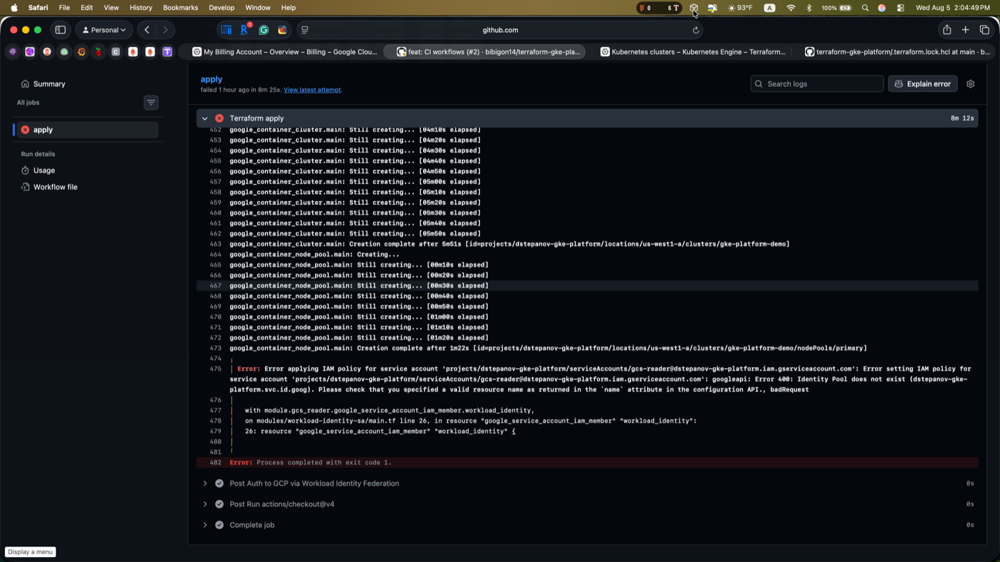

**Root cause**. The GKE identity pool `PROJECT.svc.id.goog` is provisioned asynchronously when the cluster is created with `workload_identity_config`. Without an explicit dependency, Terraform attempted the WI binding in parallel with cluster creation and hit the IAM API before the pool actually existed. The 400 is non-retryable, so Terraform surfaced it once the rest of the resources finished.

Notably, the local `terraform plan` and `validate` were both clean - the ordering bug lived below the level plan can see. This is exactly the class of failure the `production` environment gate protects against: without approval-gated apply, the stack would have ended up in a partial state on every rerun.

**Fix** ([commit `20a4d39`](https://github.com/bibigon14/terraform-gke-platform/commit/20a4d39)) added `depends_on = [google_container_cluster.main]` to the `gcs_reader` module call, so the WI binding waits for the cluster.

**Validation**. The next apply from an empty state completed in one shot, 11m 19s, no retry:

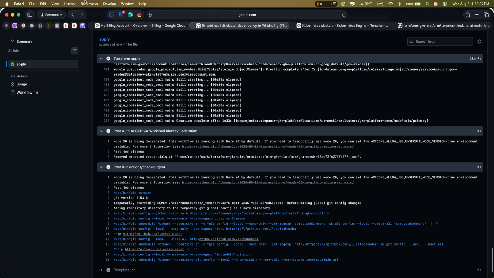

## Walkthrough

Full `apply` -> demo -> `destroy` cycle through GitHub Actions:

### 1. Apply gated by production environment

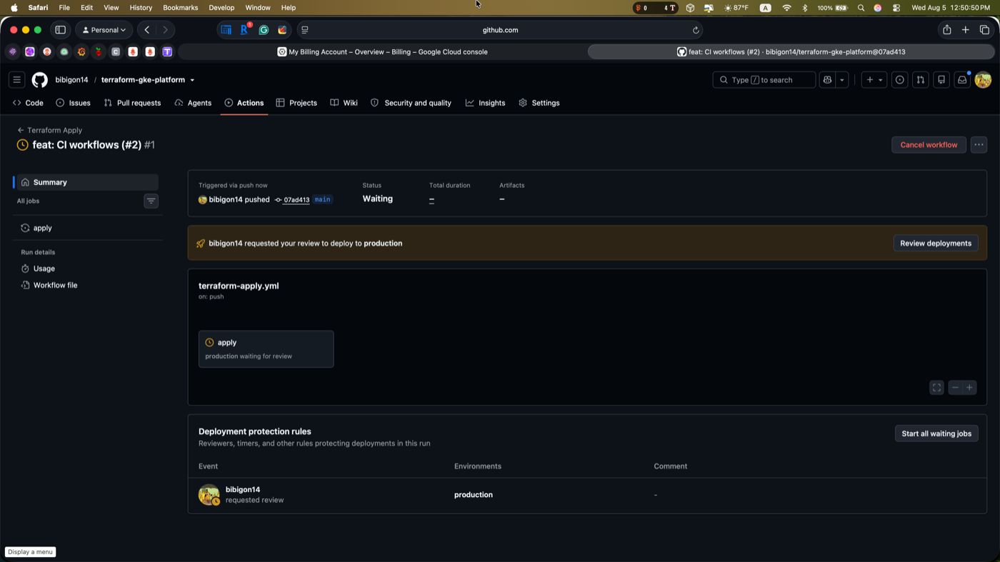

Merge to `main` triggers `terraform-apply.yml`. The job waits in the `production` environment until a reviewer approves. No auto-apply, no long-lived credentials.

### 2. Cluster provisioning

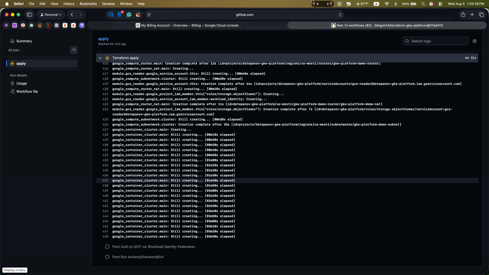

The elapsed timer on `google_container_cluster.main` is real GCP work - control plane creation takes 5-8 minutes and dominates the apply duration.

### 3. Apply complete

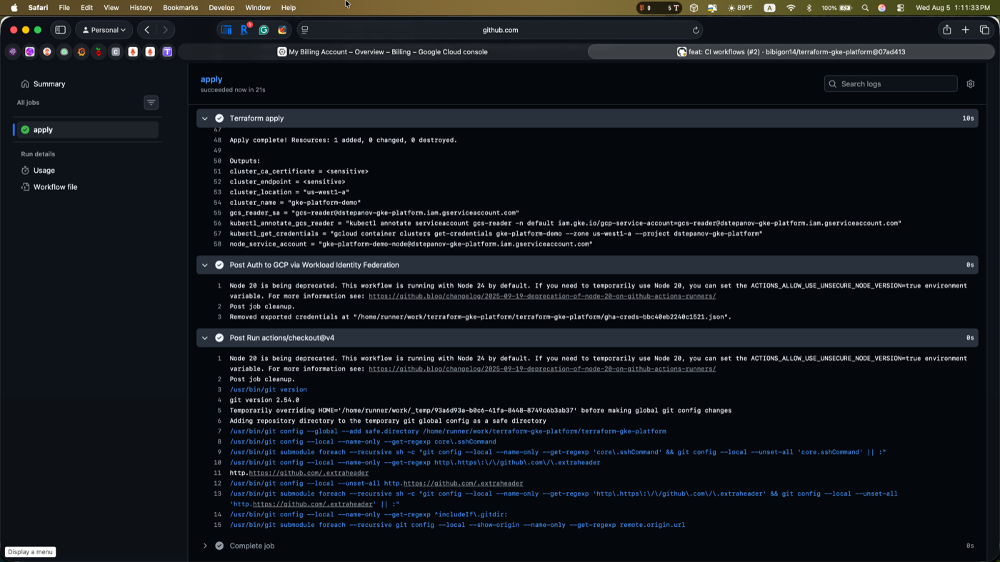

14 resources created. Outputs surface `kubectl_get_credentials` and `kubectl_annotate_gcs_reader` as ready-to-run commands.

### 4. Cluster live in GKE Console

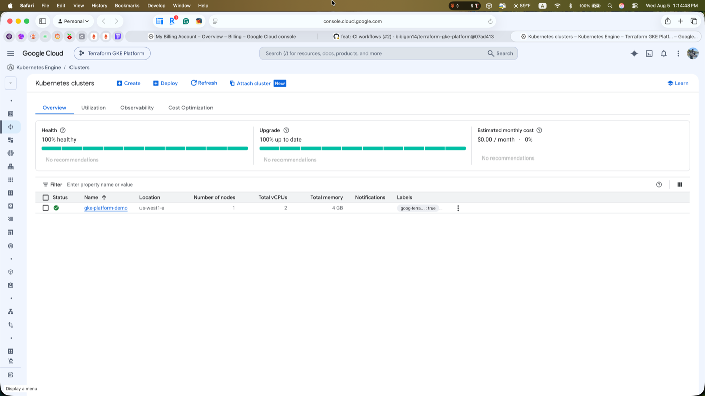

`gke-platform-demo` running, 100% healthy, auto-tagged `goog-terraform-provisioned=true` by the provider.

### 5. Local kubectl access

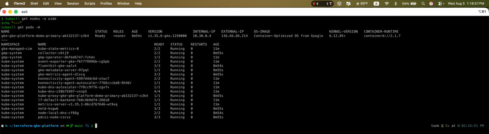

Node `Ready` in `us-west1-a` with an IP from the subnet range `10.30.0.0/20`. All GKE system pods running, including `gke-metadata-server` which is the pod-side half of the Workload Identity token exchange.

### 6. Workload Identity wired end-to-end

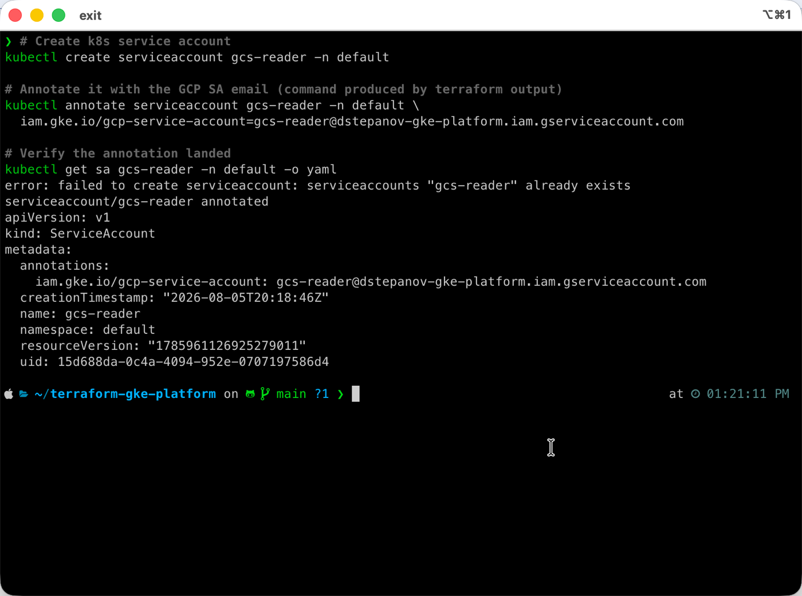

The k8s SA `default/gcs-reader` is annotated to impersonate the GCP SA created by Terraform. Any pod scheduled with this k8s SA gets `roles/storage.objectViewer` access to GCS through short-lived tokens minted at request time. No service account keys anywhere on disk.

### 7. Destroy gated the same way

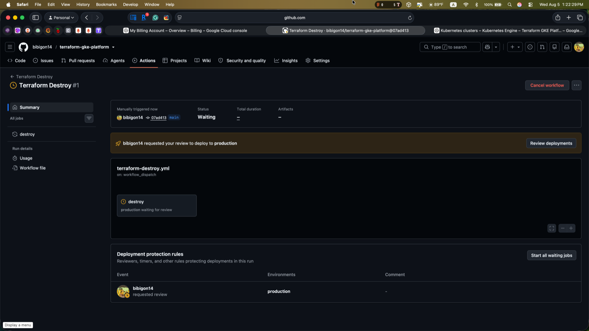

`terraform-destroy.yml` requires manual dispatch with a `confirmation=destroy` input and passes through the same `production` environment reviewer gate. Symmetry with apply is intentional - destroy is at least as destructive as apply.

### 8. Destroy complete

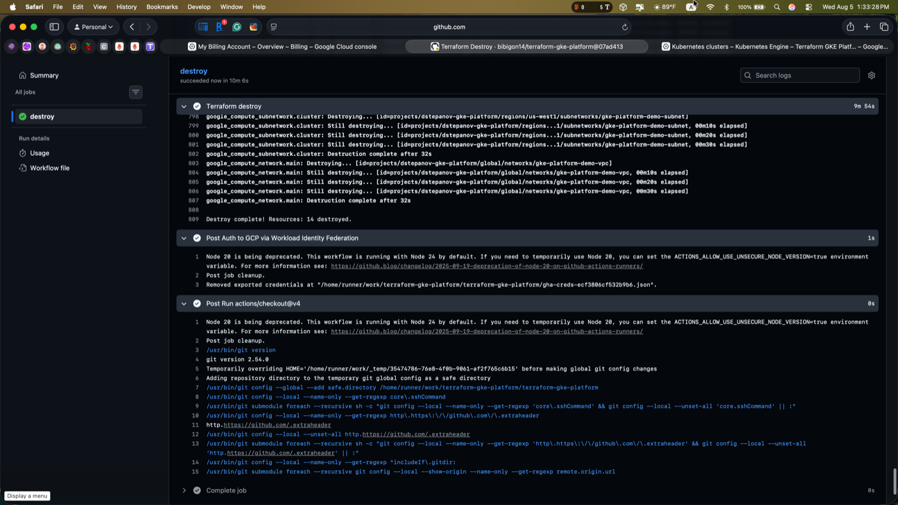

All 14 resources torn down in 10m 6s. GCS state file left behind with empty state for the next apply cycle.

## Architecture

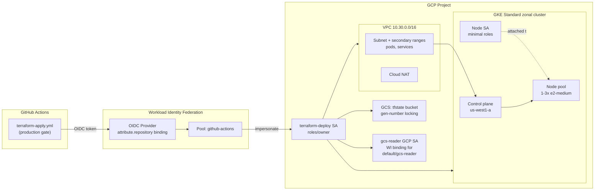

## Stack

- GKE Standard (zonal), Kubernetes REGULAR channel (currently 1.35.x)
- VPC-native cluster with dedicated subnet + secondary ranges for pods and services
- Workload Identity Federation for GitHub Actions -> GCP auth (no service account keys anywhere)
- GCS backend with object generation-number state locking (no separate lock table)
- Google Cloud provider `~> 6.0`, Terraform `>= 1.7`

## Getting started

One-time GCP setup lives in [`docs/bootstrap.md`](docs/bootstrap.md). Once bootstrap is done, all `plan` / `apply` / `destroy` happens through the workflows in [`.github/workflows/`](.github/workflows/) - triggered by PRs (plan), merges to `main` (apply, gated by the `production` environment reviewer), and manual dispatch (destroy).

## Cost and lifecycle

Full apply -> demo -> destroy cycle typically completes in under 25 minutes and costs cents. GKE control plane (~$0.10/hr for zonal, offset by the GKE free tier for one zonal cluster per account) plus one e2-medium node for the duration.

## Follow-ups (v2 backlog)

- Scope deploy service account from `roles/owner` down to per-service permissions
- Disable the default Compute Engine service account editor grant (auto-created by Google)
- Private-cluster mode: `enable_private_nodes = true`, restrict cluster endpoint public access CIDRs
- Add `tflint` + `trivy` to CI
- Pre-commit hooks with `terraform fmt` + `terraform validate`
- Autopilot mode variant as a parallel narrative ("same platform, managed mode")
